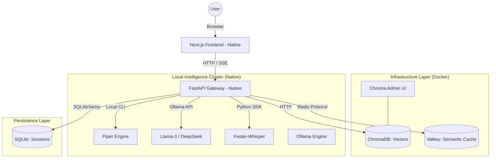

# 🛰 Kimo Labs v3.0: Hybrid Monolith Design Plan

This document provides a high-level overview of the architecture, data flow, and technology choices in Kimo Labs v2.

## 📐 System Architecture

Kimo Labs follows a **Multimodal Intelligence Node** pattern. It serves as a unified interface for separate AI execution engines (LLM, ASR, TTS).

## 🛠 Technology Stack

### 1. Frontend Layer
*   **Next.js 15+**: React framework for high-performance Page-Router/App-Router orchestration.
*   **Tailwind CSS v4**: Utility-first styling for the "Lab Console" design system.
*   **Framer Motion**: Smooth, high-fidelity UI transitions and micro-interactions.
*   **Lucide React**: Unified icon system for a clean, lab-grade interface.

### 2. Backend Gateway
*   **FastAPI**: Async Python framework for high-concurrency API performance.
*   **Uvicorn**: ASGI server implementation for production-grade speed.
*   **SQLAlchemy / aiosqlite**: Asynchronous database access for persistent session management.

### 3. Inference Engines
*   **Ollama**: Unified orchestration of local LLMs.
*   **Faster-Whisper**: High-performance Whisper reimplementation using CTranslate2.
*   **Piper TTS**: Neural speech synthesis running optimized ONNX models.

### 4. Vector & Knowledge Store
*   **LlamaIndex**: Orchestration framework for Agentic RAG and document metadata management.
*   **ChromaDB**: Native open-source vector database for high-speed semantic retrieval.
*   **ChromaDB Admin**: Visual observability layer for vector collection management.

## 🔄 Communication Flow

### Data Ingestion (Sync)
1. User uploads document → FastAPI Gateway.
2. Gateway → LlamaIndex → Embedding Model (BAAI/bge-small).
3. LlamaIndex → ChromaDB (Remote Client).

### Multimodal Query (Async/Streaming)
1. User speaks → Frontend captures PCM → Browser converts to WAV → POST /asr.
2. ASR Engine → Transcription JSON → Frontend.
3. Frontend → User Query → FastAPI /query.
4. LLM (Ollama) → SSE Data Stream → Frontend (Live UI Update).
5. (Optional) Final Response → TTS Engine → Byte Stream Playback.

## 🏗 Orchestration Strategy: Hybrid Monolith

Managed via a combination of **Docker Compose** (for data isolation) and **Native OS** (for app performance):

- `native-backend`: The FastAPI gateway running directly on Python 3.12+ for maximum M4 Neural Engine throughput.
- `native-frontend`: Next.js 15+ console running on Node 20+, optimized for Turbopack.
- `chroma-server` (Docker): Persistent vector database for RAG memory.
- `chroma-admin` (Docker): Visual observability for vector collections.
- `valkey-cache` (Docker): High-performance semantic response cache.
- `ollama` (Native): Dedicated macOS service for GGUF model inference.

---

*Kimo Labs Research Node - System Design v3.0*
